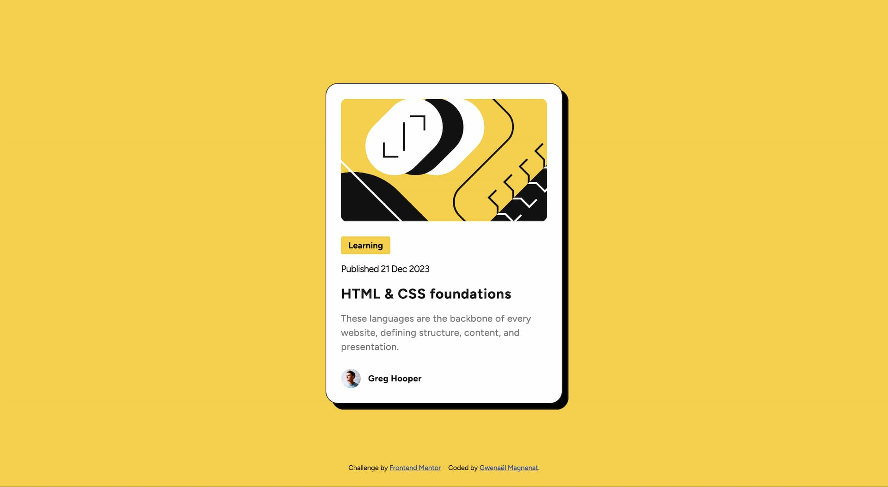

# Frontend Mentor - Blog preview card solution

This is a solution to the [Blog preview card challenge on Frontend Mentor](https://www.frontendmentor.io/challenges/blog-preview-card-ckPaj01IcS). Frontend Mentor challenges help you improve your coding skills by building realistic projects.

## Table of contents

- [Overview](#overview)
  - [The challenge](#the-challenge)
  - [Screenshot](#screenshot)
  - [Links](#links)
- [My process](#my-process)
  - [Built with](#built-with)
  - [What I learned](#what-i-learned)
  - [Continued development](#continued-development)
  - [Useful resources](#useful-resources)
- [Author](#author)

## Overview

### The challenge

Users should be able to:

- See hover and focus states for all interactive elements on the page

### Screenshot



### Links

- Solution URL: [Add solution URL here](https://your-solution-url.com)
- Live Site URL: [Add live site URL here](https://your-live-site-url.com)

## My process

### Built with

- Semantic HTML5 markup
- SCSS
- Flexbox
- Mobile-first workflow
- Vite

### What I learned

Work faster with BEM and SCSS. Naming structure for consistency.
Accessible card markup and css. The card should be clickable and focusable entirely but should not be wrapped in a link.

I need to apply `position: relative` on the card.
Then I can use this piece of css on the link to make the whole card clickable.

```css
a::before {
  content: "",
  position: absolute;
  inset: 0;
  z-index: 1;
}
```

To make the card focusable I can use `:focus-within` on the card, it will be active if an element within is focused.

```css
.card {
  &:hover,
  &:focus,
  &:focus-within {
    /* Style for hover, focus and focus-within */
    border: 2px solid yellow;
  }
}
```

### Continued development

Organise the scss code. Now it's all in one file.
Take advantage of SCSS to reduce code repetition. Use mixins.
Use more variables for spacing and sizes.

### Useful resources

- [Responsive font calculator](https://websemantics.uk/tools/responsive-font-calculator/) - This helped me to set fluid value between two breakpoint and fluid font size.

## Author

- Website - [Gwenaël Magnenat](https://gmagnenat.com)
- Frontend Mentor - [@gmagnenat](https://www.frontendmentor.io/profile/yourusername)
- Linkedin - [@gmagnenat](https://www.linkedin.com/in/yourusername)
